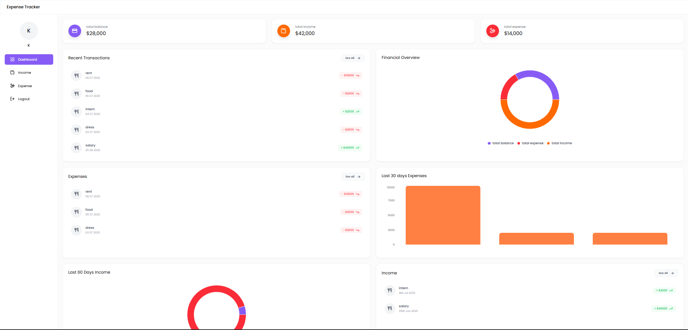
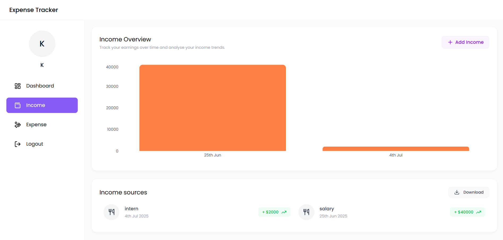
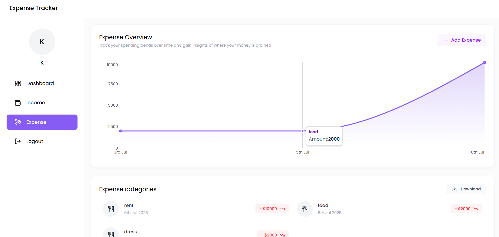

# 🧾 Expense Tracker

A sleek and responsive Expense Tracker web application built using **TailwindCSS**, **DaisyUI**, and React.js . Designed to help users manage their personal finances with clarity and elegance—track income, expenses, and visualize financial trends over time.

---

## 📌 Features

- ✅ Record, view, and delete transactions by category
- ✅ Separate Income and Expense tracking panels
- ✅ Dynamic calculation of total balance, income, and expenses
- ✅ Pie and bar charts for financial breakdown (30 & 60-day views)
- ✅ Responsive design for desktop and mobile users
- ✅ Persistent data storage using Local Storage

---

## 📊 Screenshots

### 💼 Dashboard Overview  


- Displays **total balance, income, and expense** with visual cards  
- Transaction history grouped under Income and Expense blocks  
- Charts for spending insights over time

---

### 🟢 Income Page  


- Shows all user-added **income entries** (e.g. Salary, Intern Payments)  
- Includes **amount, date, category**, and delete button for each entry  
- Green-themed for intuitive income distinction

---

### 🔴 Expense Page  


- Lists all **expense transactions** like Rent, Food, Clothing  
- Displays **category, amount, and timestamp**  
- Styled in red for quick identification of deductions

---

## 🛠️ Tech Stack

| Frontend     | Utilities     | Deployment      |
|--------------|---------------|-----------------|
| TailwindCSS  | JavaScript    | Vercel (Frontend) |
| DaisyUI      | Local Storage | Render (Backend API) |
| Figma-Inspired Layout | Modular DOM Logic | -- |

---

## 🚀 Getting Started

```bash
# Clone the repository
git clone https://github.com/Rohith292/Expense-tracker.git

# Navigate to project
cd Expense-tracker

# Open index.html in your browser or serve locally
